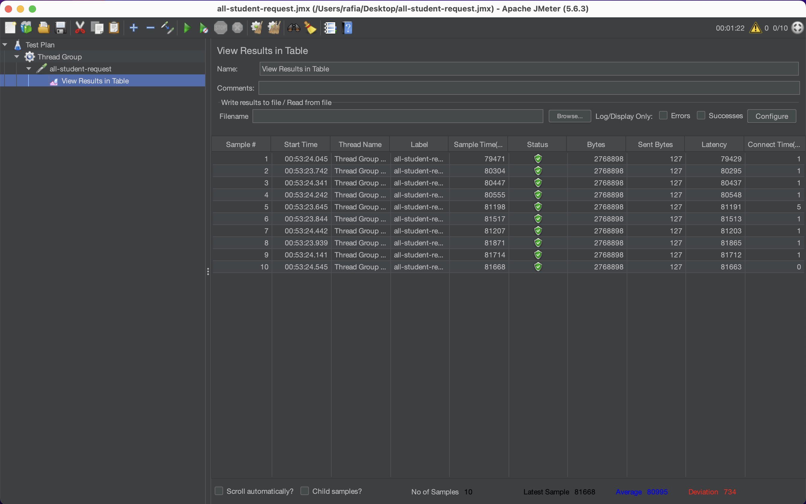
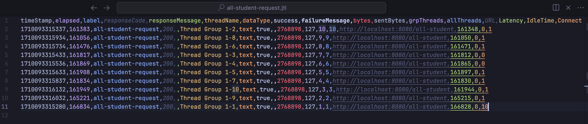
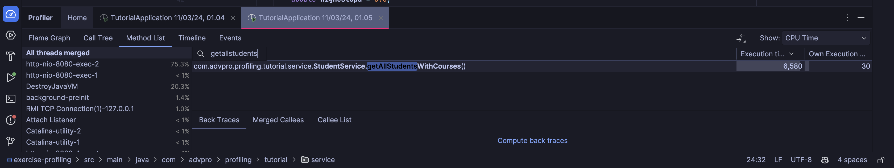
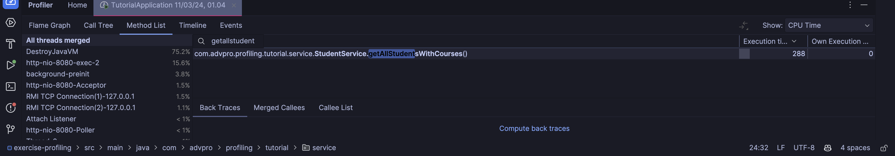
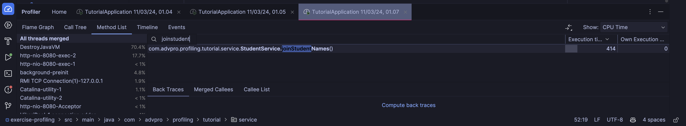
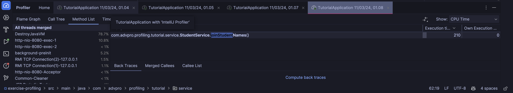

## Screenshots

### /all-student
`/all_student` using jmeter GUI

    
`/all_student` using jmeter CLI

### /all-student-name
`/all_student_name` using jmeter GUI

    
`/all_student_name` using jmeter CLI

### /highest-gpa
`/highest-gpa` using jmeter GUI

`/highest-gpa` using jmeter CLI

## Optimization results

### Method getAllStudentsWithCourses()
`/all_student` before

`/all_student_name` after

### Method joinStudentNames()
`/all_student_name` before

`/all_student_name` after

I didn't do any optimization on the highest_gpa part as it was already the most appropriate way to 
find the maximum of an array. For the all student name, I changed the implementation of concatenating strings
into using a string builder to optimize the memory usage. We can see that it can go up to 50% of optimization by using
the string builder implementation. For the all student part, I changed the implementation of using a list into 
using a map. We can utilize the key value pair for studentCourseByStudent since we can store courses for a student, and
accessing that student would only be O(1). The optimization is at a staggering 96% for this part.

## Reflection
1. The difference between the approach of performance testing with JMeter and profiling with IntelliJ Profiler is that
JMeter is used to test the performance of the application by simulating multiple users accessing the application at the
same time. It is used to test the application's performance under heavy load. On the other hand, IntelliJ Profiler is used
to profile the application to find the bottlenecks and optimize the application's performance. It is used to find the
performance issues in the application and optimize the application's performance. That's why we used IntelliJ Profiler to
see each method's performance and optimize it.

2. The profiling process helps in identifying and understanding the weak points in the application by providing detailed
information about the application's performance. It shows the time taken by each method, the memory usage, and the CPU
usage. This information helps in identifying the bottlenecks in the application and understanding the weak points. It
helps in finding the methods that are taking more time and the methods that are using more memory. This information
helps in optimizing the application's performance by improving the performance of the methods that are taking more time
and reducing the memory usage of the methods that are using more memory.

3. Yes, IntelliJ Profiler is effective in assisting me to analyze and identify bottlenecks in my application code. It provides
detailed information about the application's performance, such as the time taken by each method, the memory usage, and the
CPU usage.

4. So far the biggest challenges were finding the method in the timeline menu in the profiler, going through multiple
tabs when testing and also profiling, and waiting for the unoptimized code to finish running.

5. The main benefit that I gained from IntelliJ Profiler is that I can identify bottlenecks and optimize
the performance issues of my methods.

6. If the results from profiling with IntelliJ Profiler are not entirely consistent with findings from performance
testing using JMeter, I would analyze the results from both tools and try to find the reasons for the inconsistency.
I would check if there are any differences in the test environment, such as the number of users, the load on the
server, and the network conditions. I would also check if there are any differences in the test scenarios, such as
the test data, the test duration, and the test configuration. I would also check if there are any differences in the
test results, such as the response time, the throughput, and the error rate. I would try to find the reasons for the
inconsistency and resolve them to get consistent results from both tools.

7. Usually, I just implement what I've learned from the data structure and algorithms course. I just implement
or use a different data structure if the current one is inefficient. I also use the profiler to see the performance
of the methods and optimize them if necessary before doing the new implementation.