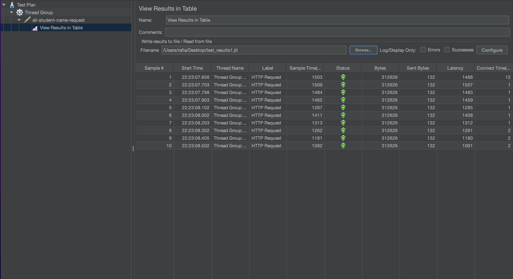
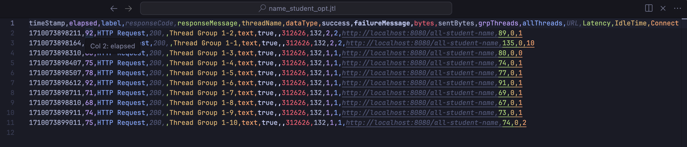

## Screenshots

`/all_student_name`

`/highest_gpa`

## Optimization results
    
`/highest_gpa`

`/all_student_name`

 
I didn't do any optimization on the highest_gpa part as it was already the most appropriate way to 
find the maximum of an array. For the all student name, I changed the implementation of using a list into
using a map since we have a key of student (id) and can have many classes. We can see that the optimization is
almost 50%