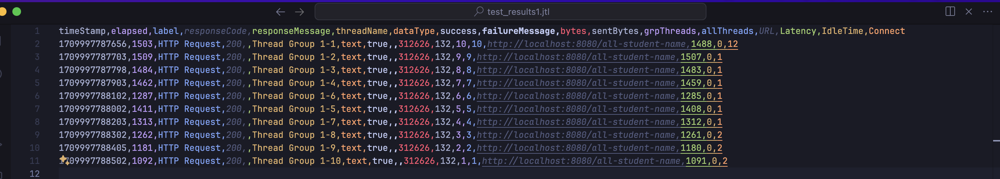

## Screenshots

`all_student`

`/all_student_name`

`/highest_gpa`

## Optimization results

`/all_student`

`/all_student_name`

`/highest_gpa`

 
I didn't do any optimization on the highest_gpa part as it was already the most appropriate way to 
find the maximum of an array. For the all student name, I changed the implementation of concatenating strings
into using a string builder to optimize the memory usage. We can see that it can go up to 95% of optimization by using
the string builder implementation. For the all student part, I changed the implementation of using a list into 
using a map. We can utilize the key value pair for studentCourseByStudent since we can store courses for a student, and
accessing that student would only be O(1). The optimization is at a staggering 99% for this part.